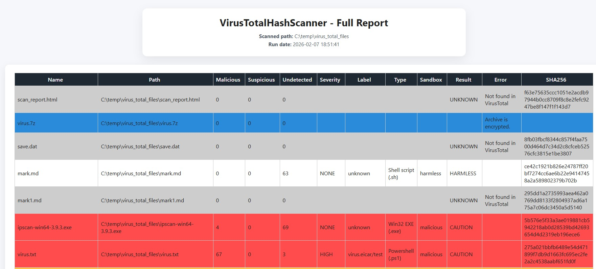
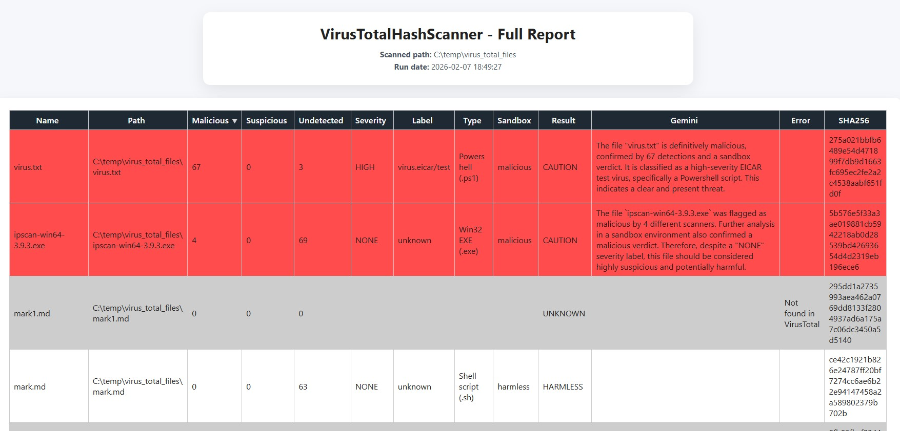
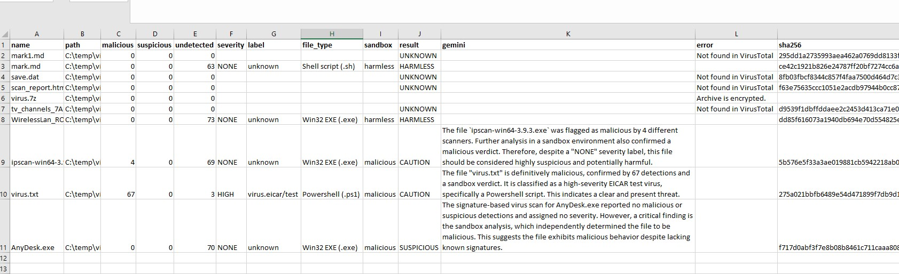

<h1 align="center">VirusTotalHashScanner</h1>

<p align="center">
Terminal based security tool. Scan directories for suspicious files.
</p>
<p align="center">
  
  
    
  
</p>

---
## Overwiew
Hash-based file scanner that checks local files against VirusTotal by SHA-256 and produces HTML and CSV reports. Optional Gemini AI summaries can be attached to suspicious results.

---
## What it does

- Walks a directory (or volume), hashes files with SHA-256, and queries VirusTotal for existing verdicts
- Generates sortable HTML reports (full, not-found, and caution/suspicious)
- Optionally exports results to CSV for Excel
- Can scan inside archives (zip/rar/7z/tar, etc.) when enabled, with safety limits
- Optionally calls Gemini to summarize "CAUTION" results


## Requirements

- Python 3.13+
- VirusTotal API key
- (Optional) Google Gemini API key for AI summaries
- (Optional) 7-Zip CLI on PATH if `INCLUDE_ARCHIVES = true`

---
## Installation

Get repo:

```bash
git clone https://github.com/<your-username>/VirusTotalHashScanner.git
cd VirusTotalHashScanner
```

Install dependencies:

```bash
python -m venv .venv
.venv\Scripts\activate
pip install -r requirements.txt
```


---
## Configuration

On first run, a default `config.ini` is created and the app exits so you can edit it. You can also copy `config_example.ini` to `config.ini`.

Key options (see `config_example.ini` for all):

- `VIRUS_TOTAL_API` (required)
- `SEND_TO_GEMINI` / `GEMINI_API` (optional)
- `RESULT_DIRECTORY` (optional, defaults to `Results` next to the app)
- `INCLUDE_ARCHIVES` (optional, requires 7-Zip CLI)
- Concurrency and rate limits for VirusTotal and Gemini
- `EXPORT_CSV` to enable CSV output

---
## Usage

Scan a directory:

```bash
python main.py -d "C:\path\to\folder"
```

Scan a volume (Windows-style example):

```bash
python main.py -v "C:\"
```

If you run without arguments, the app prompts you to choose a directory or volume.

### Output

By default, reports are written to `Results/` (or `RESULT_DIRECTORY` if set):

- `scan_report_full_YYYY_MM_DD.html`
- `scan_report_not_found_YYYY_MM_DD.html` (only if any hashes are unknown)
- `scan_report_caution_YYYY_MM_DD.html` (only if any caution/suspicious)
- `scan_report_YYYY_MM_DD.csv` (only if `EXPORT_CSV = true`)

### CSV fields

The CSV includes:

`name, path, malicious, suspicious, undetected, severity, label, file_type, sandbox, result, gemini, error, sha256`

---
## Example output

Result html



Result with enabled Gemini


CSV file



---
## Limitations

- Hash-only lookups: files are not uploaded to VirusTotal. If a hash is not present in VirusTotal, the result is "UNKNOWN".
- Archive scanning depends on 7-Zip CLI and is limited by max files/size/depth settings.
- API rate limits apply (configure `VT_REQUESTS_PER_MIN` and `GEMINI_REQUESTS_PER_MIN`).
- Volume scanning uses OS drive enumeration; behavior may vary across platforms.
- Results are as current as VirusTotal data for the hash at scan time.

### Troubleshooting

- **"VirusTotal API key is invalid"**: verify `VIRUS_TOTAL_API` in `config.ini`.
- **"7-Zip CLI not found"**: install 7-Zip and ensure `7z` is on PATH, or set `INCLUDE_ARCHIVES = false`.
- **"Not found in VirusTotal"**: the hash isn't known to VirusTotal yet.

---
## Security and privacy

This tool sends only file hashes to VirusTotal (no file content). Gemini summaries  only the scan metadata, not file contents.

## License

Licensed under the GPL-3.0.
